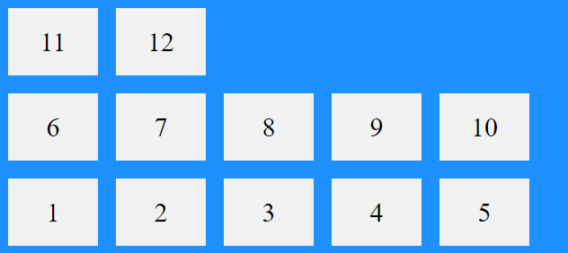

# Flexbox in CSS 
## I.What is the Flexbox in CSS?
Making it easier to design flexible responsive layout structure without using float or positioning.
> It is include attribute of tag float and positioning, out of that it has more feature
## II.Attribute in Flexbox
### 1.display 
- #### flex: 
    If attribute of display is flex,attribute wrap is row  
- #### inline-flex
    The length of flex is contain enough the flex-item
### 2.flex-direction
- #### row 
>Moreover, it has row-reverse
- #### column 
>Moreover, it has column-reverse
### 3.flex-wrap
Meaning, it is down the line
- #### nowrap
- #### wrap 
- #### wrap-reverse
    
### 4.flex-basis
Set the length of flex-item. Unit: px
### 5.justify-content
Align  all the flex-item (~the flex container) upon the main axis.
- #### flex-start
  flex-item is left to right
  .png)
- #### flex-end
    flex-item is left to right (main axis lie)
    .png)
- #### space-around
    every flex-item has a space of left and right
    .png)
- #### space-between
    The first flex-item is left and the last flex-item is right, 
    other has a space of left and right
    .png)
- #### center
    All the flex-item is align center 
    .png)
### 6.justify-self
It is the attribute for each flex-item. If u have set the attribute justify_content, u don't need to use
- #### flex-start
- #### flex-end
- #### center
### 7.align-content
**Display** all the the flex-item upon the cross axis. If u want use, it has the attribute **flex-wrap:wrap**
- #### space-between
  The first flex-items is top, the last flex-items is bottom, and other is center (has the space of top and botton)
  .png) 
- #### space-around
    every flex-item has the space of top and bottom
    .png)
- #### flex-start
    flex-item start from top
    .png)
- #### flex-end 
    flex-item start form bottom 
    .png)
- #### center 
    flex-item is center of top and bottom
    .png)
- #### stretch
    Stretching the flex lines to take up the remaining space (default value)
    .png)
### 8.align-items
**Align** the flex-item upon the cross axis. If u want use, it doesn't has the attribute **flex-wrap:wrap**
- #### center
  flex items in the middle of the flex-container
- #### flex-start
    flex items at the top of the flex-container 
- #### flex-end
    flex items at the bottom of the flex-container 
- #### stretch
    flex items to fill the container (default value)
> The image is the same, u can read to find the point different between 2 attribute :)
- #### baseline 
    aligns the flex items such as their baselines aligns
    .png)
### 9.align-self 
Same the align-content but it has set ever flex-item
- #### flex-start
- #### flex-end
- ####  center
### 10.flew-grow
Set the value of distance (upon the main axis). The flew-grow must be a number, default value is 0
Example: Make the third flex item grow eight times faster than the other flex items

### 11.flew-shrink
Specify how much a flex item will shrink relative to the rest of the flex items. (upon the main axis).The flew-shrink value must be a number,default value is 1
> I don't know much about it :(
### 12.flex-basis
Specify the initial length of a flex item.The order value must be a pixels(px), default value is 0.
### 13.order
The first flex item in the code does not have to appear as the first item in the layout.The order value must be a number, default value is 0.
## III.Shorthand for Flexbox in CSS
flew: flew-grow, flew-shrink,flew-basis
flew-flow: setting both the flex-direction and flex-wrap properties
